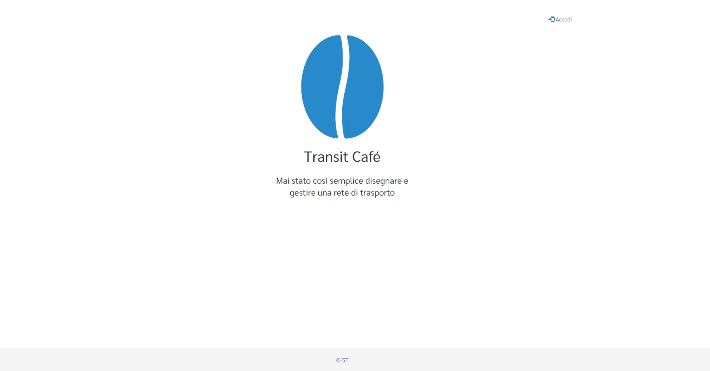

# Transit Café

Transit Café è uno strumento web per creare, gestire, validare e pubblicare dati del trasporto pubblico, in particolare dati utilizzati nel PEA (Programma di Esercizio Aziendale) e nel formato GTFS (General Transit Feed Specification).

Nelle pagine seguenti saranno illustrate le funzioni del Transit Café.
Per i dettagli si rimanda alla lista dei contenuti disponibili nella parte sinistra della pagina.

Visita la [pagina di accesso a Transit Café](https://cafe.5t.torino.it) per entrare nella piattaforma.

Per richieste di supporto nell'utilizzo dello strumento contattare cafe@5t.torino.it.
