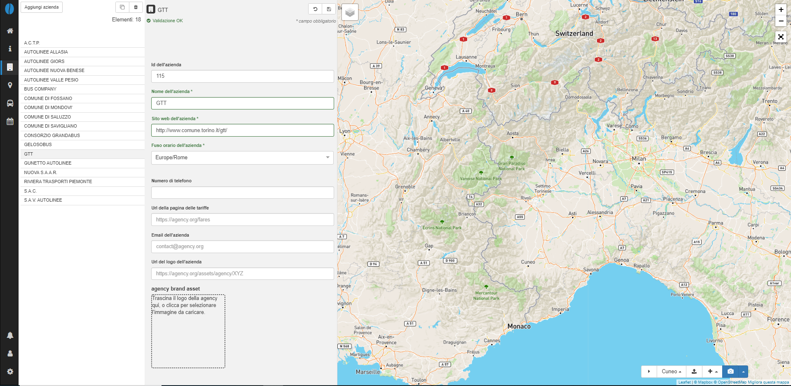

# Aziende

In questa pagina si possono trovare le informazioni inerenti gli operatori/aziende di trasporto pubblico che operano il servizio.

## Inserimento di una nuova azienda

Per creare una nuova azienda di trasporto, clicca `+ Aggiungi azienda`.
Per inserire i dettagli di una nuova azienda, o operatore di trasporto, è necessario compilare alcuni campi obbligatori richiesti dalle specifiche GTFS:

- *Nome dell'azienda*: il nome completo dell'azienda o operatore del servizio;
- *Sito web dell'azienda*: la url del sito web dell'azienda, deve contenere http:// o https://;
- *Fuso orario dell'azienda*: il fuso orario di riferimento in base alla posizione geografica dell'azienda.

I campi obbligatori sono evidenziati in rosso dal sistema fino al termine della loro compilazione; la mancanza di uno di questi campi non permette il salvataggio delle informazioni.
Ad ogni azienda, se non completato in fase di inserimento dati, sarà assegnato un id azienda univoco.

Sono inoltre disponibili alcuni campi opzionali:

- *Id dell'azienda*: identificativo univoco di una azienda di trasporto;
- *Numero di telefono*: numero di telefono di contatto dell'azienda;
- *Url della pagina delle tariffe*: la URL di una pagina web che permette di acquistare biglietti online, deve contenere http:// o https://;
- *Email dell'azienda*: indirizzo email di contatto dell'azienda;
- *Url del logo dell'azienda*: URL in cui è possibile specificare il logo dell'azienda;
- *agency branding asset*: campo in cui è possibile inserire tramite drag&drop/trascinare il logo dell'azienda di trasporto.

**Nota:** come per i nuovi oggetti creati (ad eccezione dei percorsi), la nuova azienda non sarà salvata finchè non sarà cliccato il tasto salva (💾).

## Modifica azienda

Per iniziare a modificare le informazioni relative alle aziende esercenti il servizio, clicca il marker corrispondente nella barra di navigazione a sinistra.

