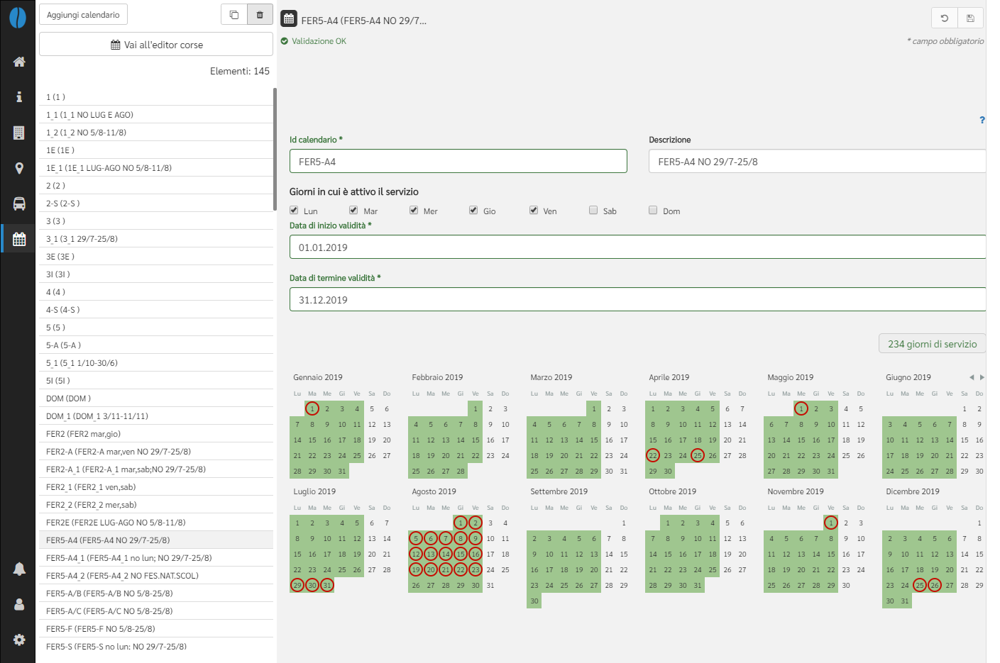
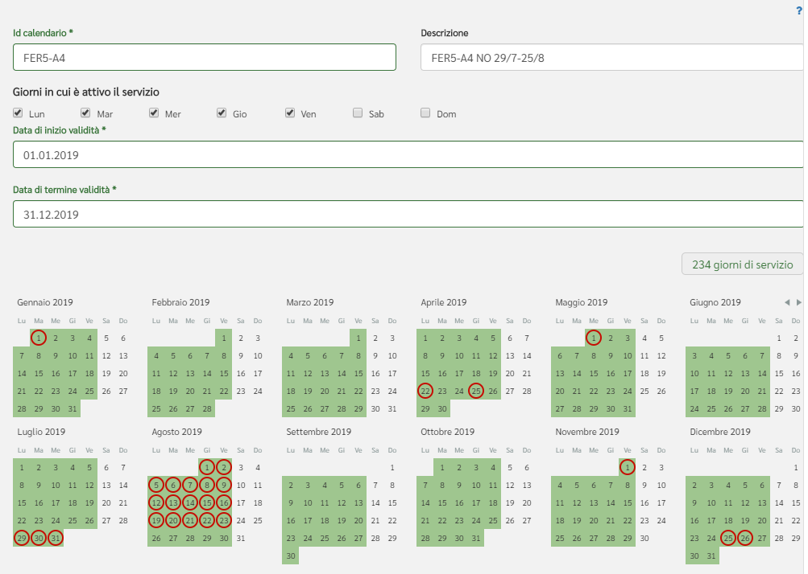
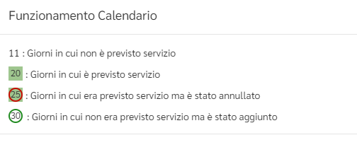

# Calendari
Da questa sezione è possbile impostare il periodo di validità delle corse.

#### Modifica o crea calendari

Per iniziare a modificare i calendari, clicca l'icona 📅 nella barra di navigazione a sinistra e scegli un calendario dalla lista.

Per creare un nuovo calendario, clicca `+ Aggiungi calendario`.

Il campo *Id calendario* può essere compilato a piacere; per avere qualche indicazione sulla nomenclatura esistente si può consultare la pagina [Nomenclatura calendari](../appendix-naming-calendar).

*Nota*: come per i nuovi oggetti creati (ad eccezione dei percorsi), il nuovo calendario non sarà salvato fino alla selezione del tasto `Salva`(💾).

#### Dettagli del calendario
È necessario compilare alcuni campi come da specifiche GTFS:

- *Id calendario*: identificativo univoco per il calendario;
- *Descrizione*: descrizione opzionale per il calendario (default impostato sui giorni della settimana specificati);
- *Giorni in cui è attivo il servizio*: giorni della settimana in cui opera il servizio;
- *Data di inizio validità* e *Data di termine validità*: il primo e ultimo giorno di validità assegnato ad un calendario.

È inoltre presente il numero dei giorni di servizio che varia dinamicamente a secondo delle modifiche dell'utente al calendario di validità del servizio.

Il calendario sottostante riporta per esteso i giorni di attività del servizio formattati secondo la simbologia in vigore.

Sopra il campo `Descrizione` è presente un punto interrogativo: cliccandovi sarà possibile consultare la legenda.

Per maggiori dettagli sulla creazione di un calendario, è possibile consultare il seguente *video tutorial*:

#### Modifica orari corse
Clicca `Vai all'editor corse` per iniziare a creare o modificare i passaggi in fermata programmati per un percorso di una linea. Sarai reindirizzato all'*editor corse*.

*Nota*: devono essere stati creati in precedenza almeno una linea, un percorso e un calendario per poterne modificare gli orari.

Per ulteriori informazioni su come associare gli orari ad un percorso, vedi [Orari](schedules).
