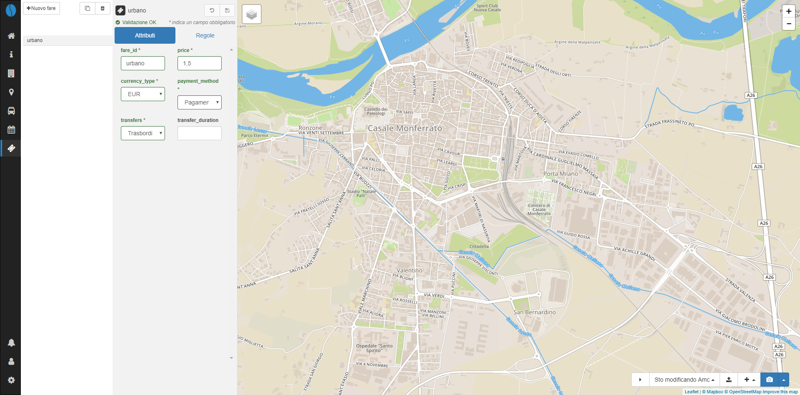
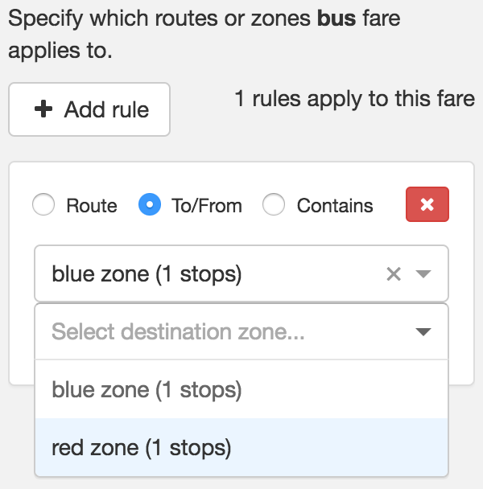
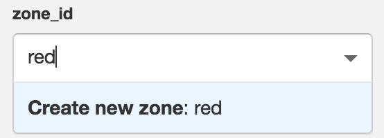

# Tariffe

## Modifica tariffe

Per iniziare a modificare le tariffe dei biglietti, clicca l'icona del biglietto nella barra di navigazione a sinistra.

Scegli una tariffa dalla lista per iniziare le modifiche. Per creare una nuova tariffa, clicca `+ Nuova tariffa`. **Nota:** come le tutte le nuove entità create (ad eccezione dei percorsi), la nuova tariffa non sarà salvata finchè non sarà selezionata l'icona del salvataggio (💾).

## Attributi della tariffa

Gli attributi della tariffa descrivono le informazioni di base di una tariffa. Ulteriori dettagli in merito sono disponibili sulle [specifiche GTFS](https://developers.google.com/transit/gtfs/reference/fare_attributes-file).

## Regole tariffarie

Per modificare le regole che definiscono le tariffe, è necessario creare e salvare una tariffa con attributi. Dopo aver scelto una tariffa, clicca il tab `Regole tariffa` e definisci una o più regole utilizzando le tipologie seguenti:

1. **Linea** - si applica ad ogni itinerario che include una linea
2. **Dalla/alla zona** - si applica ad ogni itinerario che è percorso dalla zona di origine a quella di destinazione
3. **Contiene zona** - si applica ad ogni itinerario che attraversa *ogni* zona `contenuta`

**Nota:** le regole delle tariffe possono essere complesse, vedi le [specifiche GTFS](https://developers.google.com/transit/gtfs/reference/fare_rules-file) per ulteriori informazioni sull'applicazione delle regole tariffarie.

  

## Crea zone tariffarie

Per creare una zona tariffaria da utilizzare nelle regole di tariffazione, è prima necessario selezionare una fermata che si vuole includere nella zona. Clicca nel menu a discesa `zone_id` ed inizia a digitare il nuovo `zone_id`. Clicca `Crea nuova zona: [zone_id]` e poi salva la fermata. Ripeti l'operazione per tutte le zone di cui si ha bisogno.

  

Una volta create ed assegnate ad una o più fermate, le zone tariffarie possono essere utilizzate nella definizione delle regole tariffarie per **Dalla/alla zona** o **Contiene zona**.
