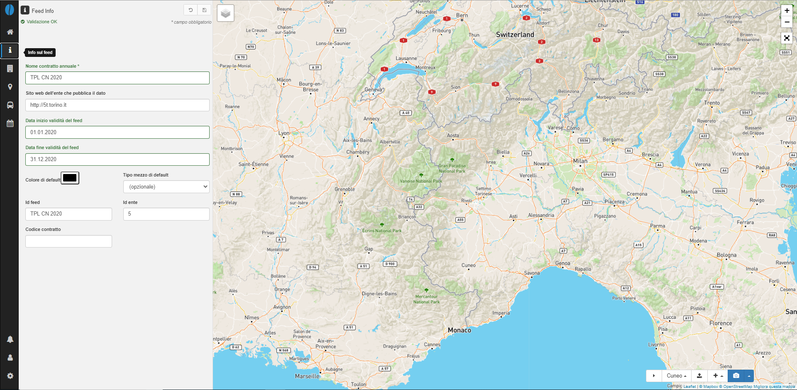

# Feed info

Questa pagina contiene informazioni generiche sulla base dati in analisi. È richiesta la compilazione di alcuni campi obbligatori:

- *Nome contratto annuale*: il nome dell'azienda/ente che pubblica il feed;
- *Sito web dell'ente che pubblica il dato*: la url dell'ente/azienda che pubblica il feed;

Sono inoltre presenti i seguenti campi opzionali:

- *Data di inizio validità del feed*: la data di inizio validità del servizio programmato descritto nel feed;
- *Data di fine validità del feed*: la data di fine validità del servizio programmato descritto nel feed;
- *Colore di default*: colore da associare al feed;
- *Tipo mezzo di default*: tipo mezzo di default che opera il servizio (esempio bus, treno, metro, ecc.);
- *Id feed*: identificativo del feed;
- *Id ente*: identificativo dell'ente di riferimento per il servizio;
- *Codice del contratto*: codice del contratto di servizio registrato presso l'Osservatorio del Ministero dei Trasporti.

Il campo **Nome contratto annuale** è utilizzato nell'intestazione dei report in formato pdf presenti nella parte manager. In caso questo campo non sia compilato, il titolo del report non sarà completo sui pdf.

