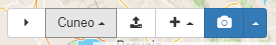
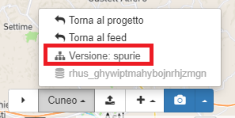

# Concetti generali

L'**Editor** di Transit Café permette agli utenti di modificare i file GTFS e i PEA importati dal manager (vedi [Caricare versioni di feed nell'editor](../../user/managing-projects-feeds/#loading-feed-versions-into-editor)) o di creare un GTFS o un PEA da zero.

Una volta iniziata la modifica di un feed, è possibile effettuare alcune operazioni descritte di seguito.

##### Salvare nell'Editor

Quando si modificano elementi nell'Editor, è necessario salvare manualmente ogni cambiamento usando il tasto con l'icona del salvataggio (💾) per evitare modifiche accidentali. L'unica eccezione è per i percorsi, le cui modifiche vengono salvate automaticamente.

##### Navigare nell'Editor

Le principali componenti di un file GTFS (feed info, routes, stops e calendars) corrispondono alle icone presenti nella barra di navigazione sulla sinistra dello schermo. Cliccando su queste icone, è possibile creare, modificare o cancellare elementi nel feed.

Dalla pagine delle **[Linee](routes)** si può accedere alle sottosezioni relative a:

- **[Percorsi](patterns)** (entità *shapes* e *stop times* del GTFS): permettono agli utenti di creare una o più sequenze di fermate per una data linea. Per esempio, una linea potrebbe avere un percorso inbound (da periferia a centro) e outbound (da centro a periferia).
- **[Orari](schedules)** (entità *trips* e *frequencies* del GTFS): definisce le corse di un percorso, che saranno definite in base agli orari di passaggio in fermata o intervalli di frequenza.

##### Utilizzare la barra di accesso rapido

Nell'angolo in basso a destra dell'Editor, è posizionata la barra di accesso rapido che ha alcune funzionalità utili in fase di modifica.

Da sinistra a destra, queste funzionalità sono:

- nascondi la barra di accesso rapido;
- tasto multifunzione con il nome del feed che permette di:
  - tornare al feed;
  - tornare al progetto;
  - vedere il nome della versione di origine dei dati in modifica nell'editor
  - riferimento al database che contiene i dati della versione in modifica nell'editor.

  

- carica uno shapefile dei percorsi delle linee per visualizzare le polilinee come aiuto visivo per la digitalizzazione dei percorsi. Il file dovrà essere caricato in formato *.zip*;
- crea un nuovo elemento (azienda, fermata, linea, calendario, ecc.);
- fai uno snapshot (punto di salvataggio) per lo stato corrente del dato (o torna allo snapshot precedente).
