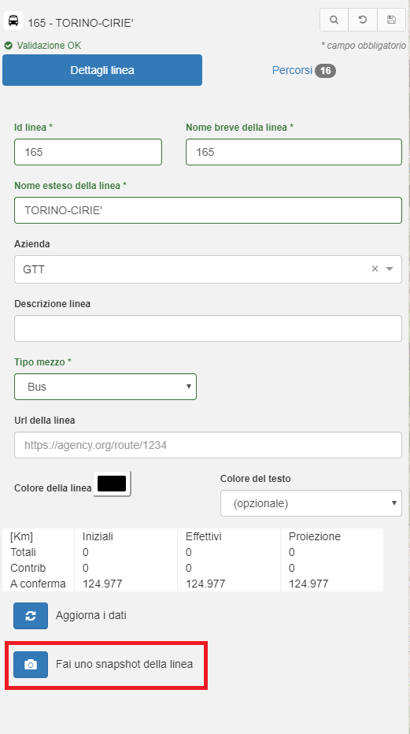
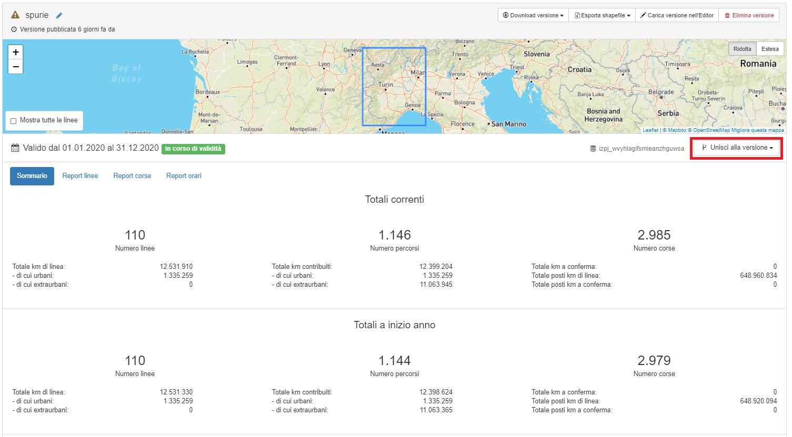

# Snapshot della linea

Questa funzionailtà permette di isolare una linea in un ambiente di lavoro e poterla reimportare in un feed esistente.

Il flusso di lavoro da seguire è:

- dalla scheda *Dettagli linea* nell'editor si seleziona il tasto `Fai uno snapshot della linea`;

- lo snapshot della linea contiene solo la linea in questione e può essere caricato sull'editor per apportare le modifiche necessarie, eseguendo opportuni snapshot durante le fasi di lavoro;
- parallelamente il feed originale può subire modifiche ed essere versionato più volte;
- ultimate le variazioni sulla linea, si promuove a versione lo snapshot finale della linea per procedere all'unione della linea modificata con il feed completo;
- dal manager si seleziona la versione contenente la sola linea e tramite il menu a tendina `Unisci alla versione` si sceglie la versione del feed completo su cui si vuole riversare la linea;
- questa operazione origina un nuovo snapshot che prende il nome nella forma *nome Feed completo + nome Linea modificata*;
- lo snapshot può essere caricato nell'editor per verifica/ulteriori modifiche ed infine promosso a versione definitiva e completa.

Alcuni dettagli relativi alla logica di unione a cui fare attenzione:

- la linea isolata e poi riunita sovrascrive completamente la sua copia nel feed di origine, compresa di percorsi, corse e geometrie dei percorsi;
- se sulla versione della linea separata si crea un nuovo calendario, a cui si associano corse della linea, questo viene importato come nuovo calendario sul feed di unione;
- se si modificano calendari esistenti, le modifiche **non** vengono riportate sul feed di unione, dove gli stessi calendari potrebbero aver subito variazioni durante il normale flusso di lavoro.
