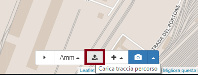
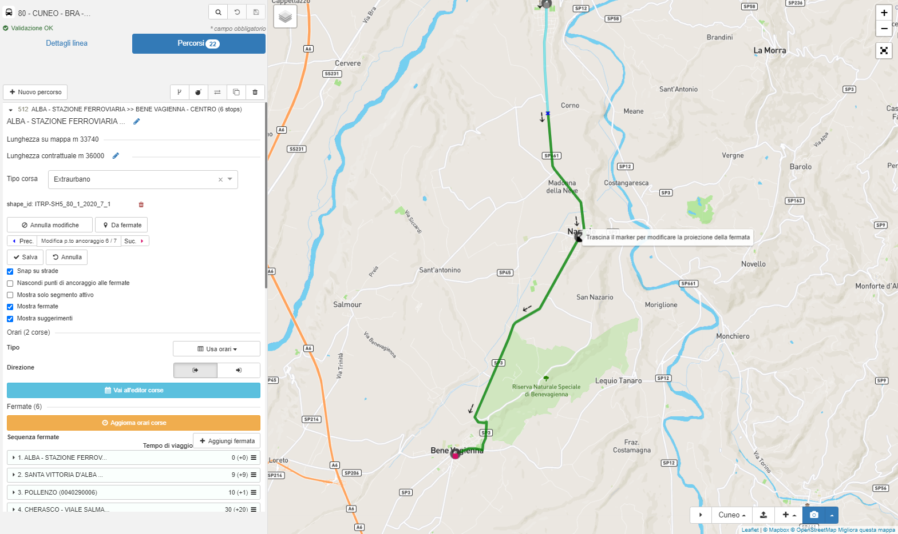

# Percorsi

In questa pagina si possono trovare le informazioni inerenti la descrizione dei percorsi presenti nel territorio in cui è attivo il servizio.

## Modifica o crea percorsi

Per iniziare a modificare percorsi, è necessario selezionare o creare una linea. Clicca sul tab `Percorsi`.

Dopo aver selezionato un percorso tra quelli proposti, puoi utilizzare il tasto `Zoom all'estensione del percorso` rappresentato con l'icona 🔍 (in alto nella barra degli strumenti) e sulla mappa sarà visualizzato l'intero percorso che si sta modificando.

Per creare un nuovo percorso , clicca `+ Nuovo percorso`.

### Barra degli strumenti percorso

- **Versiona percorso**: permette di duplicare un percorso e tutte le corse ad esso associate. Viene richiesta una data di inizio validità del nuovo percorso ed automaticamente viene limitata la validità del percorso di partenza.

- **Termina percorso**: permette di terminare un percorso e tutte le corse ad esso associate. Viene richiesta una data di termine validità da applicare alle corse.

- **Inverti percorso**: per invertire la sequenza di fermate di un percorso, clicca il tasto con le frecce opposte.

  *Nota*: questa è una azione distruttiva e dovrebbe essere utilizzata solo per un percorso duplicato.

- **Duplica percorso**: crea una copia del percorso attivo (il nome del percorso duplicato diventerà `[Nome percorso] copy`) se è necessario crearne uno similare, ma con una geometria differente.

- **Elimina percorso**: elimina il percorso attivo.

  *Nota*: i percorsi cancellati non potranno essere ripristinati.

## Dettagli percorso

Per ogni percorso sono definite le seguenti informazioni:

- *Nome*: il nome del percorso della linea, ad esempio un servizio che percorre l'intera lunghezza della linea o che ne copre solo una parte.
- *Lunghezza su mappa*: indica la lunghezza in metri del percorso misurato su cartografia.
- *Lunghezza contrattuale*: indica la lunghezza in  metri ufficialmente assegnata al percorso, sulla quale vengono poi calcolati i corrispettivi contrattuali. Questo campo è modificabile cliccando sulla matita presente vicino al numero.
- *Tipo corsa*: indica se la corsa è di tipo *Urbano* o *Extraurbano*.
- *Shape_id*: identificativo della geometria.
- *Modifica geometria percorso*: cliccando su questo tasto sarà possibile modificare la geometria del tracciato. Per maggiori dettagli consulta le sezioni seguenti della documentazione.  
- *Da fermate*: questo tasto permette di creare una nuova geometria per il percorso in esame a partire dalle fermate ad esso associate.

  *Non sarà possibile tornare alla geometria iniziale utilizzando questo comando.*

*Nota*: questa operazione sovrascrive il precedente tracciato, che rimarrà visibile con un tratteggio rosso nella sessione di modifica corrente ma non sarà selezionabile dall'utente.

- *Usa orari/frequenze*: indica se il percorso usa gli orari o le frequenze di passaggio in fermata.
- *Direzione*: corrisponde al campo `direction_id` del GTFS. Tutte le corse associate al percorso avranno associata la direzione indicata: questo dato può essere valorizzato come `outbound` (movimento dal centro città verso fuori), `inbound` (movimento da fuori città verso il centro) oppure può essere nullo.

#### Barra degli strumenti per le fermate nella linea
La barra degli strumenti per le fermate è raggiungibile cliccando la fermata del percorso su mappa ed è una scorciatoia per alcuni comandi:

- *Salva*: salva ogni modifica al tempo di viaggio e di attesa.
- *Rimuovi*: rimuovi la fermata dal percorso.
- *Aggiungi*: aggiungi la fermata alla sequenza. Questo è utile per percorsi che potrebbero utilizzare la stessa fermata più volte (es. linee circolari).

## Sequenza fermate
#### Aggiungi fermata
Un percorso contiene una sequenza di fermate: per inserirle clicca `+ Aggiungi fermata`. È possibile aggiungere fermate cercandole per nome dal menu a discesa che appare o facendo zoom sulla mappa e cliccando sull'icona della fermata e selezionando `+ Aggiungi fermata`.

Aggiungendo fermate, il tracciato del percorso sarà aggiornato seguendo la rete stradale fino al completamento della linea.

Per maggiori dettagli sulla creazione di un percorso a partire da una sequenza di fermate, è possibile consultare il seguente *video tutorial*:

#### Inserisci fermate all'interno della sequenza delle fermate
Se ti accorgi di aver saltato una fermata della sequenza, la potrai aggiungere in seguito senza alcuna complicazione. Se aggiungi fermate dal menu a discesa, queste possono essere inserite solo alla fine della sequenza. Nel caso di inserimento da mappa, si potrà scegliere l'ordine in cui inserire la nuova fermata.

#### Cambiare l'ordine delle fermate
Se una fermata si trova nell'ordine sbagliato all'interno della sequenza, è possibile selezionarla e trascinarla nella posizione corretta dalla visualizzazione come lista. L'ordine della sequenza di fermate sarà aggiornato solo al termine del trascinamento della casella.

*Nota*: inserendo fermata all'interno della sequenza o cambiando l'ordine delle fermate, il tracciato del percorso non sarà aggiornato automaticamente. Sarà necessario modificare il tracciato manualmente o cliccare sul tasto `Crea` per rigenerare la geometria del tracciato del percorso a partire dalle fermate.

#### Rimozione fermate
Le fermate possono essere rimosse dal percorso cliccando sul tasto rosso 🗑 nella scheda estesa della fermata o cliccando sulla fermata di interesse dalla mappa.

#### Modifica orari corse
Clicca `Vai all'editor corse` per iniziare a creare o modificare corse/frequenze per un percorso: sarai reindirizzato all'Editor corse. Per ulteriori informazioni sulla creazione di orari per un percorso, vedi [Orari](schedules).

#### Aggiorna orari corse
Lo strumento `Aggiorna orari corse` permette di aggiornare automaticamente tutti gli orari di tutte le corse di un percorso quando, ad esempio, si aggiungono o rimuovono fermate dal percorso. Cliccando `Aggiorna orari corse` si sovrascrivono gli orari di arrivo e partenza per tutte le corse del percorso in analisi, in modo da rispettare i tempi di viaggio e di sosta impostati a livello di percorso.
È inoltre possibile aggiornare gli orari solo a partire da una determinata fermata scelta dall'utente: in questo caso le modifiche saranno applicate esclusivamente a partire dalla fermata selezionata.

*Nota*: questa operazione sovrascriverà anche gli orari modificati a mano sull'editor corse.

Per maggiori dettagli sull'aggiunta/rimozione di una fermata dal percorso e il conseguente aggiornamento degli orari delle corse, è possibile consultare il seguente *video tutorial*:

## Passaggi in fermata
#### Calcola passaggi
La velocità media della linea può essere utilizzata per calcolare gli intertempi tra fermate. Una volta aggiunte le fermate e creato il tracciato, è sufficiente cliccare `Calc. Tempi` e gli intertempi tra fermate saranno compilati automaticamente. Si possono inserire informazioni legate a:

- *Velocità media*: la velocità media (in km/h) da usare per calcolare i tempi;
- *Tempo di sosta*: permette di assegnare lo stesso tempo di sosta alle fermate di una linea.

#### Tempi inseriti manualmente
I tempi per ogni fermata possono essere assegnati sia dalla scheda della fermata nella lista delle fermate sia cliccando sulla fermata dalla mappa. È necessario compilare 2 campi:

- *Tempo di viaggio*: tempo impiegato per arrivare alla fermata corrente da quella precedente (dovrebbe essere pari a 00:00 nella prima fermata della sequenza);
- *Tempo di sosta*: tempo in cui il veicolo resta in attesa in fermata prima di partire per la fermata successiva.

## Modifica geometria percorso
Come menzionato in precedenza, il tracciato della linea sarà disegnato automaticamente in base a come vengono inserite le singole fermate all'interno della sequenza. Tuttavia, se fosse necessario migliorare il tracciato generato automaticamente, cliccando su `Modifica geometria percorso` sarà possibile modificare i segmenti del tracciato che compongono il percorso.
Selezionando un arco del percorso, questo sarà evidenziato in verde ad indicare che il tratto selezionato è attivo e modificabile.

Gli estremi del tratto selezionato saranno evidenziati con un quadrato di colore *blu* (primo nodo del tratto) e *rosso* (nodo finale). Il nodo selezionato sarà indicato con un *quadrato nero*, se coincidente con un fermata, oppure con una *x nera*, in caso rappresenti un punto di ancoraggio. Sono inoltre presenti i tasti `Prec` e `Suc` con relativa icona per scorrere rapidamente tra i vertici dei singoli tratti del tracciato.

*Nota*: per una visualizzazione ottimale in fase di modifica, si consiglia di disabilitare `Nascondi punti di ancoraggio delle fermate` e `Mostra fermate`.  

Per maggiori dettagli sulla modifica della geometria di un percorso, è possibile consultare il seguente *video tutorial*:

#### Caricamento geometria esistente per ricalco

In caso si volesse tracciare la geometria a partire da uno shapefile esistente, è possibile selezionare nella barra di accesso rapido in basso a destra il tasto centrale con l'icona di una freccia verso l'alto ⬆️.

Si aprirà quindi una finestra che permette di caricare uno shapefile zippato contenente la geometria di interesse. Questi tracciati saranno visualizzati su mappa come sfondo e potranno essere ricalcati utilizzando gli strumenti di modifica percorso di Transit Café.

Ogni geometria presente nello shapefile è cliccabile e mostra tutte le informazioni presenti nella tabella attributi.

Le geometrie degli shapefile sono rappresentate con colori assegnati in modalità casuale, che cambia con ogni operazione di pan/zoom su mappa. Se nella tabella attributi dello shapefile fosse presente un campo denominato "COLOR" contenente il colore in formato esadecimale (ad esempio *#336688*), questo sarà assegnato alla geometria di riferimento.

#### Modifiche di base

Una volta modificato il tracciato di una linea, ci sono alcune funzionalità a cui prestare attenzione:

- trascinando un nodo (✕) sarà creato un nuovo allineamento tra fermate o con i nodi circostanti;
- cliccando due volte sull'arco attivo del tracciato, sarà aggiunto un nodo al segmento.

Sono inoltre disponibili le seguenti opzioni abilitabili in fase di modifica:

- *Snap su strade*: fai snap sui segmenti tra nodi e fermate sulle strade. Se non selezionati, i segmenti creeranno linee diritte tra nodi e fermate (es. per disegnare i percorsi delle linee ferroviarie).
- *Nascondi punti di ancoraggio alle fermate*: non mostrare punti intermedi di ancoraggio del tracciato.
- *Mostra solo segmento attivo*: visualizza su mappa solo il segmento selezionato.
- *Mostra fermate*: rendi visibili le fermate.
- *Mostra suggerimenti*: mostra suggerimenti sulle funzionalità.

Per *modificare segmenti* di percorso già esistenti è possibile:

- cliccare su *Modifica geometria perc.* e deselezionare *Nascondi punti di ancoraggio alle fermate*: in questo modo saranno visualizzati dei quadrati grigi in corrispondenza dei nodi di ancoraggio del percorso;
- selezionare l'arco di interesse, che sarà colorato di verde per indicare che il segmento è attivo e modificabile;
- cliccare sul quadrato di interesse (estremo del segmento) e trascinarlo fino al punto desiderato. Il quadrato diventerà nero quando selezionato.
- salvare le modifiche cliccando su *Salva*.

Per *rimuovere punti di passaggio* dal percorso è necessario cliccare sulla *X* che appare sulla geometria: il punto sarà rimosso istantaneamente e la geometria sarà modificata automaticamente.
