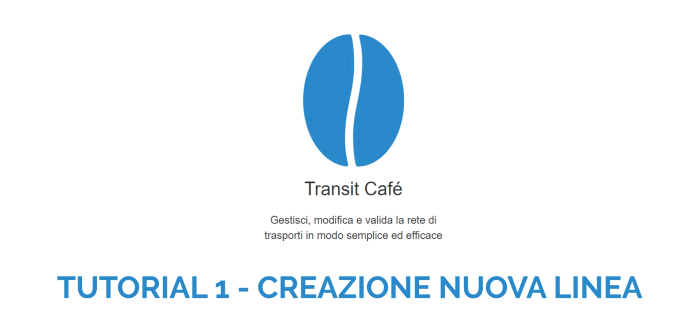

# Linee

In questa pagina si possono trovare le informazioni inerenti le linee presenti nella base dati in analisi.

### Modifica o crea linee

Per modificare le linee, clicca sul tasto 🚍 sulla barra di navigazione a sinistra.
Scegli una linea dalla lista o cercala per nome nel menu a tendina.

Per creare una nuova linea, clicca `+ Aggiungi linea`.

**Nota:** come tutti i nuovi oggetti creati (ad eccezione dei percorsi), la nuova linea non sarà salvata fino alla selezione del tasto `Salva` (💾).

Per maggiori dettagli sulla creazione di una linea, è possibile consultare il seguente *video tutorial*:

### Zoom all'estensione della linea

Cliccando sul tasto 🔍 (nella parte alta della toolbar) avendo una linea selezionata, sulla mappa saranno visualizzati tutti i percorsi della linea in analisi.

### Dettagli della linea

È necessario compilare alcuni campi obbligatori richiesti dalle specifiche GTFS:

- *Id linea*: identificativo univoco della linea. Se non inserito dall'utente, viene creato in automatico;
- *Nome breve della linea*: nome del servizio/linea, può essere un numero;
- *Nome esteso della linea*: il nome completo della linea, spesso include origine e destinazione;
- *Tipo mezzo*: il tipo di veicolo/trasporto usato sulla linea.

Sono inoltre disponibili alcuni campi opzionali:

- *Azienda*: nome dell'azienda di trasporto che opera il servizio;
- *Descrizione linea*: una descrizione della linea. Attenzione a non ripetere l'informazione presente nel *nome esteso*;
- *Url della linea*: un link alla pagina web con informazioni su una specifica linea, ad esempio gli orari;
- *Colore della linea*: se una linea ha un colore associato (da usare in un calcolo percorsi ecc), può essere impostato in questo campo;
- *Colore del testo*: se una linea ha un colore da utilizzare per il testo (da usare in un calcolo percorsi ecc), può essere impostato in questo campo.

È inoltre presente una tabella che riporta a livello di linea i km iniziali, effettivi e in proiezione calcolati a partire dalle corse previste a calendario. Per maggiori informazioni vedi la sezione [Versionamento corse](schedules).
In caso di variazioni ai percorsi e alle corse della linea è necessario cliccare il tasto `Aggiorna i dati`, in modo da visualizzare i totali km aggiornati alle ultime modifiche.

In caso di variazioni consistenti alla linea, è possibile estrapolare dalla base dati la linea di interesse cliccando il tasto `Fai uno snapshot della linea`. Per maggiori dettagli vedi la sezione [Snapshot della linea](line_snapshot). 

Una volta compilati i campi richiesti e quelli di interesse tra quelli opzionali, clicca `Salva`.

### Percorso

Una volta creata e salvata la linea, è possibile iniziare a creare la traccia del percorso.

[Impara a modificare un percorso »](patterns)
