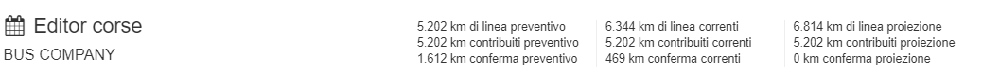

# Orari
La sezione *Orari* è accessibile dai percorsi delle linee selezionando `Vai all'editor corse` o dal tab *Calendario*.

L'editor corse permette agli utenti di creare/modificare corse specificando linea, percorso e calendario.

I selettori nella parte alta della pagina permettono all'utente di navigare tra i calendari e i percorsi di una linea all'interno di un feed.
Nell'intestazione della pagina è presente l'indicazione dell'operatore che opera il servizio.

Ogni selettore riporta una serie di informazioni aggiuntive come card:

- **Linea**
    - n° di corse per la linea selezionata.
- **Percorso**
    - n° di corse per il percorso selezionato;
    - lunghezza in km del percorso selezionato.
- **Calendario**
    - n° di corse per il percorso selezionato;
    - n° di corse attive per il calendario selezionato per il feed in analisi;
    - n° di giorni di servizio per il calendario selezionato;
    - link alla pagina del calendario in esame.

Nel selettore calendario la card che indica il numero di corse di un percorso sarà evidenziata in verde se ci sono corse per la linea e il percorso selezionato.

Per maggiori dettagli sull'inserimento di una corsa, è possibile consultare il seguente *video tutorial*:

#### Barra degli strumenti degli orari
In alto a destra sullo schermo è presente una barra degli strumenti utile per effettuare alcune operazioni sugli orari:

- *Offset corsa(e)*: specifica un offset (`HH:MM`) per impostare l'orario dell'ultima corsa nel foglio o della riga selezionata;
- *Aggiungi corsa*: aggiungi nuova corsa (primo timepoint è `00:00:00`);
- *Duplica corsa(e)*: duplica la prima corsa della tabella o la riga selezionata;
- *Elimina corsa(e)*: elimina righe selezionate;
- *Annulla tutto*: annulla tutte le modifiche;
- *Salva*: salva tutte le modifiche.

#### Seleziona corse
Per selezionare una corsa per fare un offset, duplicarla o eliminarla, è sufficiente cliccare sul numero della riga nella parte sinistra della riga: la riga selezionata apparirà evidenziata in verde. Per selezionare tutte le corse, clicca la casella nell'angolo in alto a sinistra.

### Modificare gli orari
Per ogni corsa è possibile modificare i seguenti campi:

- **Codice corsa**: identificativo della corsa che rimane invariato anche in caso di versionamento della corsa;
- **Contrib**: identifica se la corsa sia o meno contribuita;
- **Km**: lunghezza in km della corsa;
- **Calendario**: indicazione del calendario a cui appartiene la corsa;
- **gg serv**: riporta il numero di giorni di servizio per il calendario a cui fa riferimento la corsa;
- **Km di linea**: lunghezza in km della corsa calcolata in base ai giorni di servizio;
- **Proiez Km**: lunghezza in km della corsa riferita all'anno solare successivo, ma calcolata con il numero di giorni di servizio dell'anno in corso (valorizzato vuoto di default, campo da compilare in caso di versionamento);
- **S**: numero di posti a sedere previsto per la corsa;
- **P**: numero di posti in piedi previsto per la corsa;
- **ac**: corse a conferma;
- **Inizia**: data di inizio validità del calendario (da valorizzare in caso di versionamento, default come da calendario o 01/01);
- **Termina**: data di fine validità del calendario (da valorizzare in caso di versionamento, default come da calendario o 31/12);
- **Orario arrivo/partenza**: orari di arrivo e partenza (partenze mostrate in grigio) per ogni fermata lungo il percorso.

Si ricorda che viene definita corsa *a conferma* una corsa che rispetti il percorso definito di una linea, attivabile o meno in base alla richiesta dell’utenza, e corsa *a chiamata* una corsa che effettua solo le fermate pianificate secondo le prenotazioni/chiamate degli utenti.

I chilometri delle corse indicate *ac* saranno conteggiati in un campo dedicato dei totali km.

Per maggiori dettagli sulla modifica di una corsa, è possibile consultare il seguente *video tutorial*:

*Nota*: gli orari inseriti nell'editor sono riportati secondo il formato `13:00:00`.

### Versionamento corse
Nella parte superiore della pagina `Orari` sono presenti 3 coppie di valori numerici, che varieranno in base alle modifiche effettuate nella tabella contenente le corse:

- *Km preventivo*: km effettuati da tutte le corse del percorso nell'anno solare in corso, calcolati in base alla situazione ad inizio anno (senza tener conto dei successivi versionamenti). È presente anche l'indicazione dei km contribuiti.  

- *Km correnti*: km effettuati da tutte le corse del percorso nell'anno solare in corso, calcolati in base alla situazione attuale *di compilazione dei campi "Inizia" e "Termina"* (tenendo quindi conto delle corse versionate). È presente anche l'indicazione dei km contribuiti.  

- *Km in proiezione*: il campo riporta il numero di km che sarebbero effettuati nel caso le ultime modifiche alle corse fossero effettive per  tutto l'anno solare (rappresenta una proiezione dei km sull'anno successivo, ma è calcolata con il numero di giorni di servizio dell'anno solare in analisi). È presente anche l'indicazione dei km contribuiti.   

