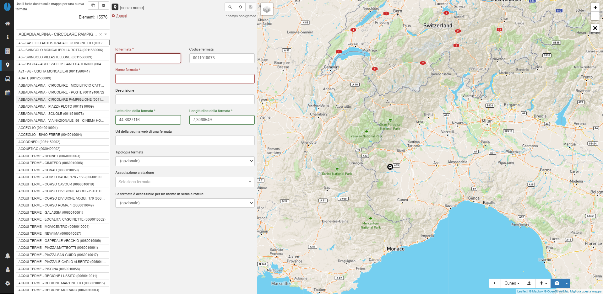
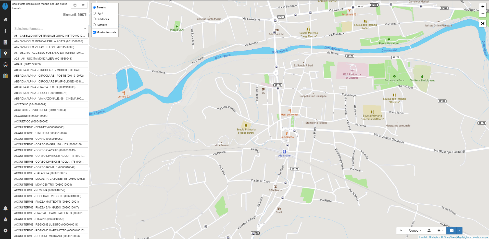

# Fermate

In questa pagina si possono trovare le informazioni inerenti le fermate presenti sul territorio in cui è attivo il servizio di trasporto pubblico.

### Informazioni sulle fermate
Per ogni fermata è necessario che alcuni campi siano compilati, come richiesto dalle specifiche GTFS:

- *Id fermata*: identificativo univoco della fermata o stazione;
- *Nome fermata*: nome della fermata;
- *Latitudine della fermata*: latitudine della fermata;
- *Longitudine della fermata*: longitudine della fermata.

Ad ogni fermata, se non presente in fase di inserimento dei dati, sarà assegnato un id fermata univoco.

Sono inoltre disponibili alcuni campi opzionali:

- *Codice fermata*: numero/codice che identifica la fermata per i passeggeri;
- *Descrizione*: descrizione della fermata;
- *Url della pagina web di una fermata*: contiene la url di una pagina web della fermata;
- *Tipologia fermata*: identifica se lo stop di interesse è una fermata o una stazione;
- *Associazione a stazione*: identifica l'eventuale stazione associata ad una fermata;
- *La fermata è accessibile per un utente in sedia a rotelle*: identifica se dalla fermata in analisi è possibile per un utente in sedia a rotelle salire sul mezzo in transito.

### Seleziona una fermata

Scegli una fermata dalla lista o cerca per nome la fermata dal menu a tendina.
È possibile fare uno zoom sulla cartografia mentre è visibile la lista delle fermate: in questo modo appariranno sulla mappa le fermate e sarà possibile selezionarne una per visualizzare i dettagli.

### Visualizza tutte le fermate di un feed

Per visualizzare tutte le fermate di un feed, passa il cursore sull'icona della mappa (angolo in alto a sinistra sulla mappa) e seleziona il layer `Mostra fermate`. Una volta selezionato, saranno visibili tutte le fermate del feed (rappresentate con un cerchio in blu) anche a bassi livelli di zoom. Questo layer può essere visualizato anche se la lista delle fermate non è  visibile e può essere d'aiuto in caso l'utente voglia visualizzare la posizione delle fermate lungo la linea o i percorsi di interesse.

