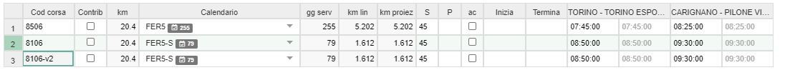
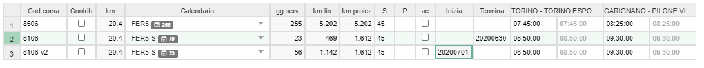
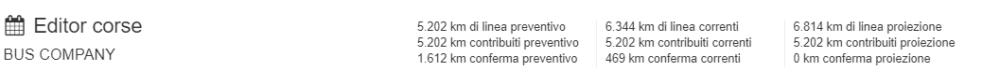
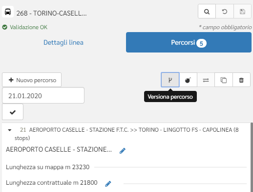
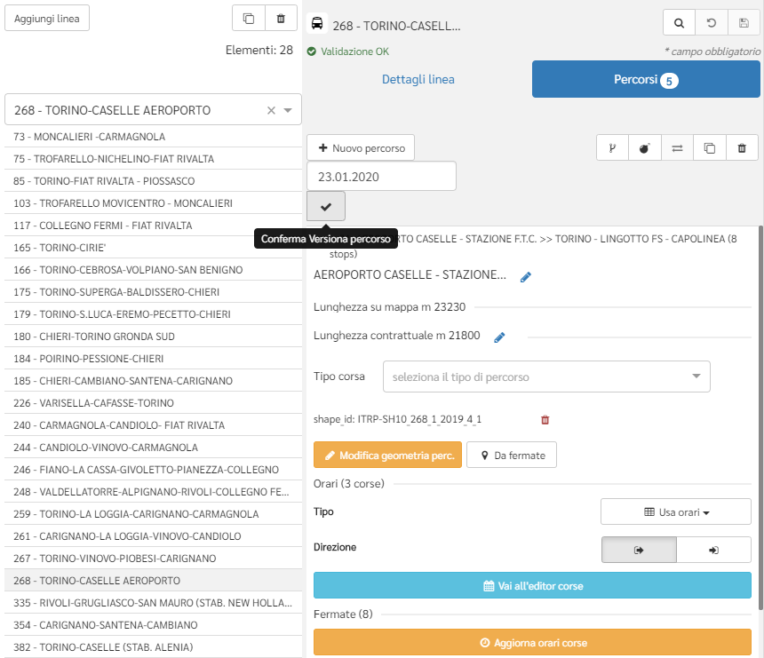
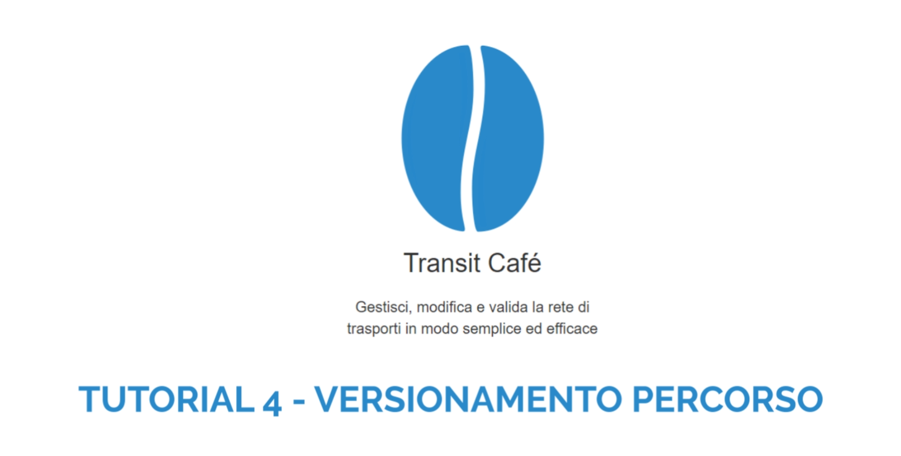

# Versionamento

Questa pagina riassume i passaggi necessari per il versionamento dei dati nell'area editor di Transit Café.

Lo strumento permette alcune tipologie di versionamento:

- versionamento corse: agisce sulle corse e sul loro periodo di validità;
- versionamento percorso: agisce sul percorso, sulle corse ad esso associate e sul loro periodo di validità.

### Versionamento corse

Questo tipo di versionamento è gestibile dalla pagina dell'editor `Orari` dopo aver selezionato la linea e il percorso di interesse. Si utilizza nelle seguenti casistiche:

- associazione della corsa ad un differente calendario a partire da una certa data;
- modifica campo ‘Contrib’(contribuito) a partire da una certa data.

Per procedere al versionamento di una corsa sono necessari i seguenti passaggi:

- selezionare una o più corse da versionare cliccando sul numero della riga sulla sinistra della tabella;
- cliccare il tasto `Duplica` posizionato sotto la barra di selezione del percorso: in questo modo si creano 2 corse identiche;

- assegnare un codice univoco al *codice corsa*: in questo campo si può concatenare una sigla che indichi il versionamento (es. -v2);

- compilare il campo *Inizia* con la data di inizio validità per la nuova corsa e il campo *Termina* con una data precedente a quella inserita nel campo *Inizia* per la corsa di partenza: in questo modo la corsa di origine e quella versionata avranno validità differenti;

- assegnare eventuali calendari di validità differenti o variare le informazioni inerenti le corse dove necessario.

Nella parte superiore della pagina `Orari` sono presenti 3 coppie di valori numerici, che varieranno in base alle modifiche effettuate nella tabella contenente le corse:

- *Km iniziali*: km effettuati da tutte le corse del percorso nell'anno solare in corso, calcolati in base alla situazione ad inizio anno (senza tener conto dei successivi versionamenti). È presente anche l'indicazione dei km contribuiti.  

- *Km effettivi*: km effettuati da tutte le corse del percorso nell'anno solare in corso, calcolati in base alla situazione attuale *di compilazione dei campi "Inizia" e "Termina"* (tenendo quindi conto delle corse versionate). È presente anche l'indicazione dei km contribuiti.  

- *Km in proiezione*: il campo riporta il numero di km che sarebbero effettuati nel caso le ultime modifiche alle corse fossero effettive per  tutto l'anno solare (rappresenta una proiezione dei km sull'anno successivo, ma è calcolata con il numero di giorni di servizio dell'anno solare in analisi). È presente anche l'indicazione dei km contribuiti.  

In caso di corse indicate come *ac* sarà presente anche un record che considera i km a conferma, sottraendoli dal totale km e dai km contribuiti.

### Versionamento percorso

Questo tipo di versionamento è gestibile dalla pagina dell'editor `Linee` dopo aver selezionato la linea e il percorso di interesse; si utilizza in caso di variazione della lunghezza contrattuale.

Per procedere al versionamento di un percorso sono necessari i seguenti passaggi:

- selezionare il percorso da versionare cliccando sulla linea di interesse e successivamente sul percorso che si intende modificare;

- cliccare sul tasto dedicato al versionamento del percorso;

- selezionare la data di fine validità del percorso originale e cliccare il tasto di conferma: in questo modo viene creato un percorso duplicato con lo stesso nome a cui viene concatenato il suffisso "v2" (è possibile rinominare il percorso a piacimento). Le corse del percorso originale vengono automaticamente troncate alla data indicata; il nuovo percorso eredita tutte le corse, con validità che inizia dal giorno successivo a quello indicato.

- è quindi possibile modificare il nuovo percorso in base alle necessità, agendo sulla lunghezza contrattuale, orari, variazioni di percorso, ecc.

Per maggiori dettagli sul versionamento di un percorso, è possibile consultare il seguente *video tutorial*:

Ogni tipologia di versionamento avrà effetto anche sui dati presenti nella parte manager, ma solo dopo aver eseguito uno snapshot e averlo promosso successivamente a versione: in questo modo i dati presenti nel manager rispecchieranno quelli modificati nell'editor.
