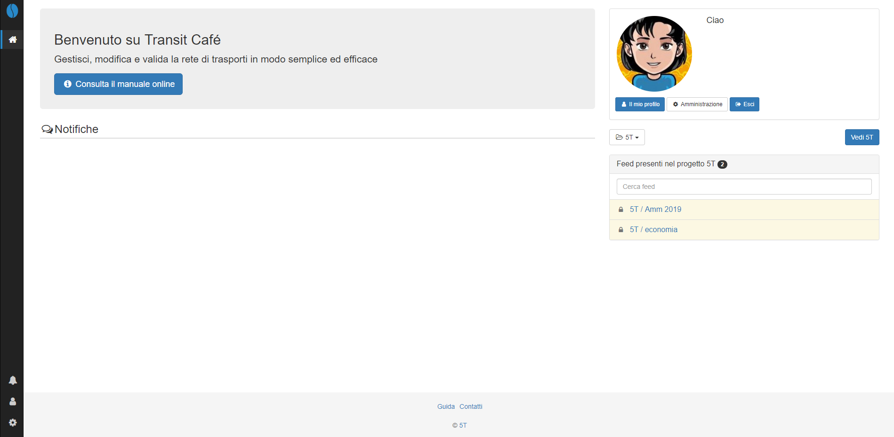
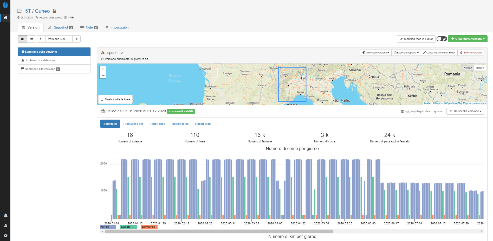
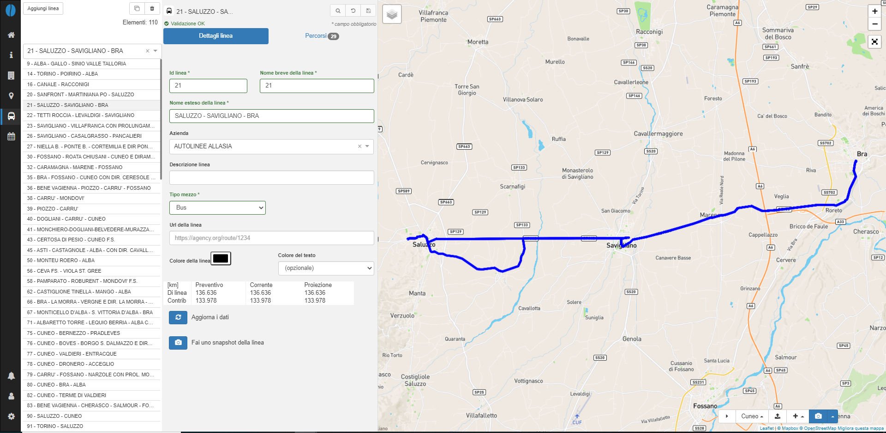

# Introduzione

### Concetti generali

Transit Café permette lo scambio di dati e il coordinamento nella creazione, aggiornamento, validazione e distribuzione di basi dati per il servizio programmato di trasporto pubblico.

È possibile la condivisione di feed GTFS/PEA esistenti o la creazione/modifica di un feed nell'Editor. È inoltre disponibile una funzione di validazione del dato per verificare la presenza di potenziali errori.

Una volta eseguito l'accesso al sistema, viene visualizzata una homepage che riporta:

- un collegamento al manuale d'uso disponibile online;
- l'indicazione dell'utenza che ha eseguito l'accesso e un collegamento alla pagina del profilo dell'utente;
- un'area in cui è possibile visualizzare notifiche su eventuali basi dati osservate (vedi [Gestione progetti e feed](manager/data-manager.md));
- un menu che permette di selezionare il progetto di interesse (in caso si sia abilitati all'accesso a più di un progetto) e l'indicazione delle basi dati presenti sullo strumento. Cliccando su una base dati si accede alle funzionalità principali di Café.

L'applicativo è costituito da 2 componenti:

- **Manager**: fornisce informazioni di carattere generale sui dati contenuti in un PEA utilizzando contatori, diagrammi e report;

- **Editor**: permette di modificare i dati contenuti in un PEA o di crearne uno nuovo. L'interfaccia ha una forte componente cartografica. Dalla barra degli strumenti presente sulla sinistra è possibile la modifica del dato in base al tipo di informazione (aziende, fermate, linee, orari e calendari di servizio).

